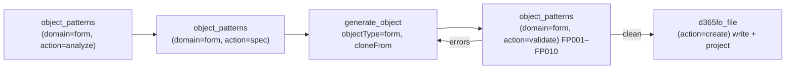

# D365 F&O MCP Server

<div align="center">

**21 AI tools that know every X++ class, table, form, and EDT in your D365FO codebase — plus optional live AxDB SQL for debugging**

> **This fork adds optional `axdb_sql`** — read-only, Windows-authenticated SQL against AxDB on the development VM, to inspect what your code actually wrote. It is off by default and invisible until configured; setup offers it only on a classic AOSService VM whose `web.config` names the AOS database. It cannot write: one SELECT checked on the T-SQL syntax tree, inside a transaction that is always rolled back. See [SQL setup](docs/AXDB_SQL.md). Install or update this fork from `main` using [Quick Start](#quick-start).

> **This fork also extends the existing build tool.** Builds run in the background and return a log path plus a result you collect later. With `restartAos:true`, `build_d365fo_project` completes compilation, runtime metadata generation and any requested database sync, then restarts the matching local IIS/IIS Express AOS and checks readiness, so new objects are loaded without a manual refresh or a second Visual Studio build. If restart/readiness cannot be confirmed, the tool tells the client AI to notify the user. Label translations use the exact locale, then a supplied parent (`it` for `it-IT`), then a disclosed fallback. [Build changes and usage](docs/BUILD_FEEDBACK.md#why-this-fork-changes-the-build-workflow)

[](https://www.npmjs.com/package/d365fo-mcp)
[](https://opensource.org/licenses/MIT)
[](https://nodejs.org/)
[](https://www.typescriptlang.org/)
[](docs/TESTING.md)
<!-- coverage-badge:start -->
[](eval/COVERAGE.md) [](eval/COVERAGE.md)
<!-- coverage-badge:end -->

*Grounded AI development for Dynamics 365 Finance & Operations — works with GitHub Copilot and Claude Code*

[](https://insiders.vscode.dev/redirect/mcp/install?name=d365fo&inputs=%5B%7B%22type%22%3A%22promptString%22%2C%22id%22%3A%22d365fo_server_url%22%2C%22description%22%3A%22D365FO%20MCP%20server%20URL%20(e.g.%20https%3A%2F%2Fyour-server.azurewebsites.net%2Fmcp%2F)%22%7D%5D&config=%7B%22type%22%3A%22http%22%2C%22url%22%3A%22%24%7Binput%3Ad365fo_server_url%7D%22%7D)
[](https://insiders.vscode.dev/redirect/mcp/install?name=d365fo&quality=insiders&inputs=%5B%7B%22type%22%3A%22promptString%22%2C%22id%22%3A%22d365fo_server_url%22%2C%22description%22%3A%22D365FO%20MCP%20server%20URL%20(e.g.%20https%3A%2F%2Fyour-server.azurewebsites.net%2Fmcp%2F)%22%7D%5D&config=%7B%22type%22%3A%22http%22%2C%22url%22%3A%22%24%7Binput%3Ad365fo_server_url%7D%22%7D)
[](https://cursor.com/install-mcp?name=d365fo&config=eyJ1cmwiOiJodHRwczovL3lvdXItc2VydmVyLmF6dXJld2Vic2l0ZXMubmV0L21jcC8ifQ%3D%3D)

*These connect an editor to a server that is already deployed — see [Quick Start](#quick-start) if you still need to set one up.*

</div>

---

## Why

AI assistants excel at C#, Python, and JavaScript. X++ is different: your D365FO codebase is private, deeply customized, and invisible to every model — so AI confidently generates code that doesn't compile.

This server pre-indexes your entire D365FO installation (580 000+ symbols across standard, ISV, and custom models) and exposes 21 specialized MCP tools (`axdb_sql` only once SQL is configured). Every signature, every CoC wrapper, every label, every form pattern — verified against your real metadata **before** the AI writes a single line.


| Task | Without this server | With this server |
|------|--------------------|------------------|
| Method signatures | Guessed → compile errors | Exact, from your codebase |
| Existing CoC wrappers | Manual AOT search | `extension_info(mode="coc")` in < 50 ms |
| New forms | Hand-written XML, broken patterns | Cloned from reference forms, validated against the pattern catalog |
| Labels | Hardcoded strings | Right `@SYS`/`@MODULE` key found instantly |
| Security chains | Hours of manual tracing | Role → Duty → Privilege → Entry Point in one call |
| Generated code | Hallucinated fields and types | Every reference proven against the index, gated before write |

---

## Capabilities

| Feature | Description |
|---|---|
| 🔍 **Full-codebase intelligence** | 580K+ symbols indexed: classes, tables, forms, EDTs, enums, labels (20M+ rows), security artifacts — FTS5 search in < 10 ms |
| 🛡️ **Grounded generation** | Fail-closed gates: `prepare` issues grounding tokens, `validate_code(mode="references")` proves every identifier, `validate_code(mode="syntax")` enforces best practices — hallucinated code never reaches disk |
| 🧩 **Form pattern engine** | Complete catalog of Microsoft form patterns and sub-patterns: recommends the right pattern, clones reference forms with datasource re-binding, **deterministically expands** patterns that have no reference form, **auto-repairs** a form's missing required controls, validates structure and blocks invalid writes |
| ✍️ **Safe metadata writes** | C# bridge uses Microsoft's own `IMetadataProvider` wherever it can express the object; the few types and ops it cannot go through structured XML writers with ambiguity guards — never blind string replacement. Automatic `.rnrproj` registration, one-call undo |
| 🏗️ **SDLC integration** | Background X++ compilation with `xppc.exe`, structured diagnostics, DB sync, xppbp best practices and SysTestRunner. `restartAos:true` reloads the local IIS/IIS Express runtime after a successful build and requested sync, with an explicit user warning if readiness cannot be confirmed. [Build workflow](docs/BUILD_FEEDBACK.md) · [Runtime restart](docs/AOS_RUNTIME_RESTART.md) |
| 🗄️ **Optional AxDB SQL — `axdb_sql`** | Read-only, live parameterized queries and table columns/keys/defaults on the development VM's AxDB. One SELECT checked on the parsed T-SQL tree, run in a transaction that is always rolled back; only database-scoped catalog views; no result cache. Data is changed through the application or X++. [Setup](docs/AXDB_SQL.md) |
| 📐 **X++ knowledge base** | Queryable rules: select grammar, CoC authoring, financial dimensions, the posting engine (`LedgerVoucher`), number sequences, `SysExtension`, Electronic Reporting, AX2012→D365FO migration — prevents deprecated APIs |

### Configure optional AxDB SQL

On a classic AOSService VM, setup reads the server and database the AOS itself uses from `WebRoot\web.config` and asks whether to enable SQL on them (default: no). It then asks whether to trust a self-signed SQL certificate (yes by default for a local server). The tool is read-only. On UDE, or with no local AOS, setup does not ask. Authentication uses the Windows account running MCP; no SQL password is collected. The updated C# bridge must be built on the D365FO VM; see the [SQL guide](docs/AXDB_SQL.md#build-the-updated-bridge).

Configure or change SQL later from this checkout with:

```powershell
npx tsx src/cli/index.ts config sql
```

Restart MCP after saving. The upstream npm package does not include this fork's additions.

### Pattern-grounded form development

Forms are the hardest artifact to generate correctly — each pattern dictates required containers, ordering, and allowed sub-patterns. The form pattern engine makes it a guided pipeline:



Structural violations (wrong order, missing container, disallowed control) **block the write** — recommendations only warn. Mined pattern statistics from your own environment ground every suggestion in reality.

---

## Quick Start

> **From D365FO platform update 10.0.49 (PU74), Visual Studio 2026 is the supported IDE for X++ development** — Microsoft no longer supports VS 2022. Earlier platform versions still use VS 2022 ≥ 17.14. [Details](https://learn.microsoft.com/en-us/dynamics365/fin-ops-core/fin-ops/get-started/whats-new-platform-updates-10-0-49)

### Install this fork from main

On your D365FO developer VM, use Node.js 24+, Git and a .NET SDK compatible with the bridge. The bridge requires the installed D365FO development assemblies; see [setup prerequisites](docs/SETUP.md). The fork's additions are in this repository's `main` branch.

```powershell
git clone --branch main https://github.com/DavideWasTaken/d365fo-mcp-server.git
cd d365fo-mcp-server
npm ci
npm run build
dotnet build bridge/D365MetadataBridge -c Release
npm run setup
```

On a classic VM whose AOS `web.config` names its database, setup offers optional AxDB SQL after the environment type. Point your editor's local MCP configuration at **this checkout's `dist/index.js`**, following [setup scenarios](docs/SETUP.md).

### Update an existing checkout of this fork

Stop the MCP process before replacing its bridge executable. From your checkout on `main`:

```powershell
git pull --ff-only origin main
npm ci
npm run build
dotnet build bridge/D365MetadataBridge -c Release
```

Restart MCP after updating. Every bridge build writes `D365MetadataBridge.sources.json` next to the binary, so `npx tsx src/cli/index.ts doctor` and `update` report a bridge that is older than its sources — including after a hand-run `git pull` — and `update` then requires the rebuild. Existing configuration is retained; use `npx tsx src/cli/index.ts config sql` when you want to enable or change SQL. Building the bridge and validating live AxDB access must be done on your developer VM; see the [SQL guide](docs/AXDB_SQL.md#build-the-updated-bridge).

### Migrate from an upstream npm installation

If upstream is already installed with `npm install -g d365fo-mcp`, its configuration and index live in that installation's data directory, not in a checkout. A checkout never reads that directory — it ignores `%LOCALAPPDATA%\d365fo-mcp\install.json` and an inherited `D365FO_CONFIG` on purpose — so a fresh checkout reports "database not found" and `npm run setup` would rebuild the index from scratch, which takes hours. Move the existing state instead:

1. **Find the data directory** while the npm install is still there: run `d365fo-mcp doctor` and read the line `Installed from npm; data directory: …`. The default is `%LOCALAPPDATA%\d365fo-mcp\installation`. Then stop MCP (close Visual Studio or the editor that launches it).
2. **Clone and build this fork** as in [Install this fork from main](#install-this-fork-from-main), but skip `npm run setup`.
3. **Copy the state into the checkout root.** From the checkout, with `$old` set to the data directory from step 1:

   ```powershell
   $old = "$env:LOCALAPPDATA\d365fo-mcp\installation"
   foreach ($d in 'config', 'data', 'extracted-metadata', 'instances') {
     if (Test-Path "$old\$d") { robocopy "$old\$d" ".\$d" /E /NFL /NDL /NJH /NJS }
   }
   ```

   Paths the wizard writes are relative (`./data/xpp-metadata.db`, …) and resolve from the new location. An absolute path you set by hand to somewhere under the old directory has to be edited.
4. **Clear `bridge.exePath`.** The npm wizard pins it to `<old data directory>\bridge\D365MetadataBridge.exe`, a bridge compiled from upstream sources without SQL support — `axdb_sql` reports the missing capability for as long as the setting points there. Delete the `exePath` key from the `bridge` section of `config\d365fo-mcp.json` (and of each `instances\<name>\d365fo-mcp.json`); left empty, the server finds the checkout's own `bridge\D365MetadataBridge\bin\Release` build.
5. **Register the server again.** The existing `.mcp.json` entry still runs the global npm package with `D365FO_CONFIG` pointing at the old directory. Point both at the checkout — `args` at `<checkout>\dist\index.js`, `D365FO_CONFIG` at `<checkout>\config\d365fo-mcp.json` — following [setup scenarios](docs/SETUP.md). For Claude Code, `claude mcp remove` the old entry and add it again with `claude mcp add-json`.
6. **Check it from the checkout**: `npx tsx src/cli/index.ts doctor` should report `Installed from git; data directory: <checkout>` and find the database. Enable SQL with `npx tsx src/cli/index.ts config sql` if you want it.

A `d365fo-mcp` command on `PATH` is still the upstream npm CLI and still manages the old directory, so run the fork's commands from the checkout as above. Once the checkout works, `npm uninstall -g d365fo-mcp` removes the ambiguity; the old data directory can then be deleted.

### Upstream package and shared servers

The npm package `d365fo-mcp`, the original project's installer and its hosted server do **not** include these fork additions. Use the checkout above for AxDB SQL and the build changes.

**Your team already runs a shared server?** Then you install nothing — point your editor at it:

```powershell
npx d365fo-mcp connect https://your-server.azurewebsites.net
```

Both paths in full — prerequisites, editor configuration for every scenario, the required instruction file, and how to verify grounding actually works: **[docs/QUICK_START.md](docs/QUICK_START.md)**

---

## Azure Deployment

One shared instance for the whole team — the metadata index lives in Blob Storage and downloads automatically on startup.

[](https://portal.azure.com/#create/Microsoft.Template/uri/https%3A%2F%2Fraw.githubusercontent.com%2Fdynamics365ninja%2Fd365fo-mcp-server%2Frefs%2Fheads%2Fmain%2Finfrastructure%2Fazuredeploy.json)

Deployment guide: [docs/SETUP_AZURE.md](docs/SETUP_AZURE.md) — includes CI/CD pipeline automation

---

## Documentation

| Getting started | Reference | Operations |
|-----------------|-----------|------------|
| [Install/update this fork](#quick-start) | [All 21 tools](docs/MCP_TOOLS.md) | [Azure deployment](docs/SETUP_AZURE.md) |
| [Upstream setup guide](docs/QUICK_START.md) | [Optional AxDB SQL](docs/AXDB_SQL.md) | [Build workflow](docs/BUILD_FEEDBACK.md) |
| [Setup scenarios A–F](docs/SETUP.md) | [`.mcp.json` reference](docs/MCP_CONFIG.md) | [DevOps pipelines](docs/SETUP_AZURE.md#azure-devops-pipelines) |
| [Claude Code setup](docs/SETUP.md#claude-code-cli) | [Configuration](docs/CONFIGURATION.md) | [Testing](docs/TESTING.md) |
| [Usage examples](docs/USAGE_EXAMPLES.md) — real tool chains | [Architecture](docs/ARCHITECTURE.md) | [Custom / ISV models](docs/CUSTOM_EXTENSIONS.md) |
| [Changelog](CHANGELOG.md) | [Knowledge authoring](docs/KNOWLEDGE_AUTHORING.md) | [Coverage](eval/COVERAGE.md) — what the badge counts |
| [Backlog](docs/BACKLOG.md) — deferred work | [New tool checklist](docs/NEW_TOOL_CHECKLIST.md) | [Eval loop](docs/AGENT_EVAL_LOOP.md) — the self-improvement harness |

## License

MIT
